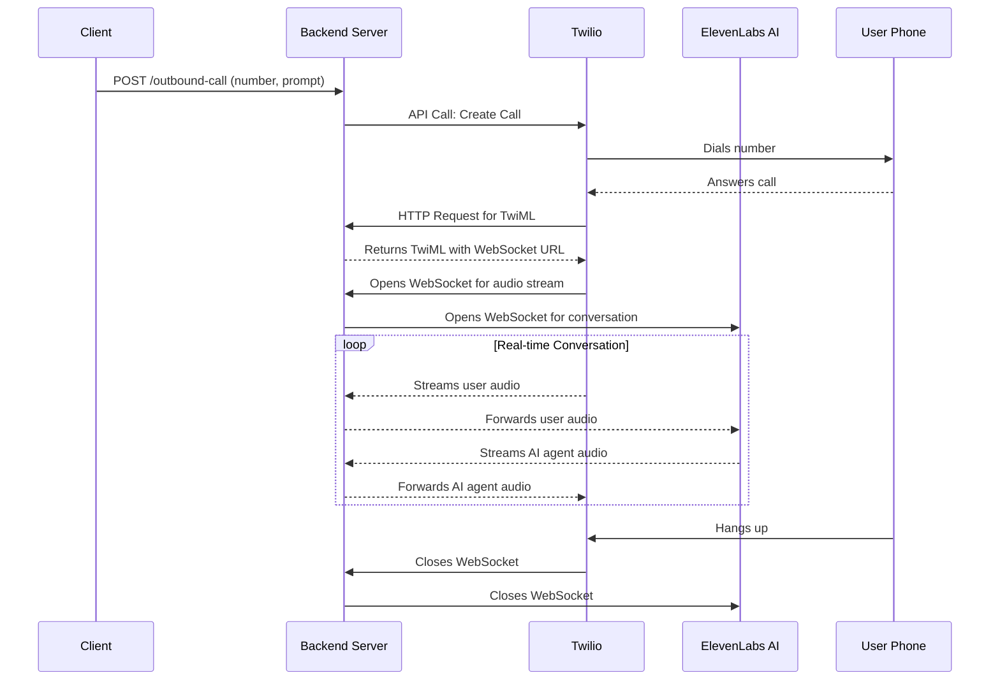

# 📞 ElevenLabs & Twilio Outbound AI Calling Backend

This project provides a complete backend server to power real-time, AI-driven outbound phone calls. It acts as a bridge, connecting **Twilio** for PSTN (phone network) connectivity with an **ElevenLabs Conversational AI agent** to handle the conversation.

This server can be used as a standalone service or as the API endpoint for the `make_outbound_call` function in an MCP server.

-----

## ✅ Core Features

  - **Twilio Voice Integration**: Uses the Twilio API to programmatically initiate outbound calls and TwiML to control the call flow.
  - **Real-time Audio Streaming**: Establishes a WebSocket connection with Twilio to stream call audio in real-time.
  - **ElevenLabs Conversational AI**: Connects to an ElevenLabs AI agent via a secure WebSocket, forwarding the caller's audio for processing and streaming the agent's audio response back.
  - **Dynamic AI Configuration**: The AI agent's behavior (`prompt`) and initial greeting (`first_message`) can be customized for each individual call through the API.
  - **Simple REST API**: Exposes a single `/outbound-call` endpoint, making it easy to integrate with other applications (like an MCP server or a CRM).
  - **Robust Connection Handling**: Manages the lifecycle of both the Twilio and ElevenLabs WebSocket connections, including initiation, message passing, and termination.

-----

## Project Structure

```
.
├── server.js        # The Fastify server for handling API requests and WebSockets
├── package.json     # Project dependencies
└── .env             # Environment variables for API keys and configuration
```

-----

## Setup instructions

### 1️⃣ Prerequisites

  - **Node.js** (v18+) and npm.
  - A **Twilio Account** with a configured phone number.
  - An **ElevenLabs Account** with an API Key and a Conversational AI Agent ID.
  - **ngrok** or another tunneling service to expose your local server to the internet so Twilio's webhooks can reach it.

### 2️⃣ Install node packages

```bash
npm install fastify ws dotenv @fastify/formbody @fastify/websocket twilio
```

### 3️⃣ Environment file setup

Create a `.env` file in the root of your project and add your credentials:

```env
# ElevenLabs Credentials
ELEVENLABS_API_KEY=your-elevenlabs-api-key
ELEVENLABS_AGENT_ID=your-elevenlabs-agent-id

# Twilio Credentials
TWILIO_ACCOUNT_SID=your-twilio-account-sid
TWILIO_AUTH_TOKEN=your-twilio-auth-token
TWILIO_PHONE_NUMBER=your-twilio-phone-number

# Server Port (Optional)
PORT=8000
```

### 4️⃣ Starting the server

1.  **Start the server:**

    ```bash
    node server.js
    ```

2.  **Expose your local server to the internet using ngrok:**

    ```bash
    ngrok http 8000
    ```

    Note the public `https://<your-ngrok-id>.ngrok-free.app` URL provided by ngrok. You will need this for Twilio's webhooks.

-----

## Example API Usage

Use a tool like `curl` or any HTTP client to make a POST request to the `/outbound-call` endpoint. Remember to use your public ngrok URL.

**Endpoint**: `POST /outbound-call`
**Headers**: `Content-Type: application/json`

**Payload**:

```json
{
  "number": "+15551234567",
  "prompt": "You are a friendly assistant from the local clinic calling to confirm an appointment.",
  "first_message": "Hello, am I speaking with Jane Doe? This is a confirmation call from your clinic regarding your appointment tomorrow at 2 PM."
}
```

**Example Curl Command**:

```bash
curl -X POST \
  -H "Content-Type: application/json" \
  -d '{
        "number": "+15551234567",
        "prompt": "You are a friendly assistant from the local clinic calling to confirm an appointment.",
        "first_message": "Hello, am I speaking with Jane Doe? This is a confirmation call from your clinic regarding your appointment tomorrow at 2 PM."
      }' \
  https://<your-ngrok-id>.ngrok-free.app/outbound-call
```

-----

## Workflow

